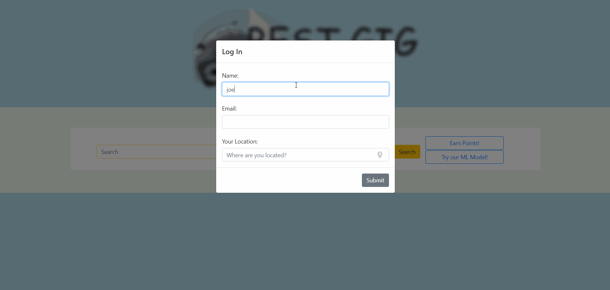
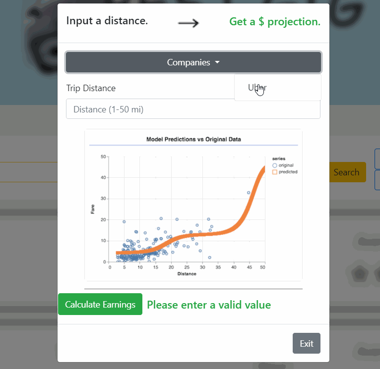

# BestGig

## Summary
The purpose of BestGig is to support hundreds of thousands of people who work in the gig economy that has skyrocketed in size in the past decade. This app shows users the average pay for gig apps in a specific city, so they will be able to make a more informed decision on which gig they decide to work in that moment. BestGig has also incorportated a machine learning algorithm using the TensorFlow.js library to provide fare estimates based off of the distance of a trip.

## Disclaimers 

We currently only have data on San Francisco companies, but are working on integrating with the Glassdoor API to provide results for locations that don't have any reviews yet. Additionally, the Tensorflow.js model doesn't run live in the browser, but was trained separately. It uses the length of an Uber ride to predict the price a driver will receive. We're also in the process of building a more complex multivariate model (that will incorporate factors like time of day/day of the week to give workers more accurate estimates). 

[Live Site](https://bestgig.herokuapp.com/)

## Technologies Used
* [Visual Studio Code](https://code.visualstudio.com) - source code editor
* [Node](https://nodejs.org/en/) - a run-time environment that executes Javascript code outside the browser
* [Bootstrap](https://getbootstrap.com/) - framework for creating responsive page with CSS, jQuery, and JS
* [Tensorflow.js](https://www.tensorflow.org/js) - open source library for client side machine learning

## Node Packages
* [Sequelize](https://www.npmjs.com/package/sequelize) - a promise-based node.js ORM for MySQL.
* [Express](https://www.npmjs.com/package/express) - a minimalist web framwork for node.js
* [Express-Handlebars](https://www.npmjs.com/package/express-handlebars) - used to send html for routes.
* [MySQL2](https://www.npmjs.com/package/mysql2) - used to access MySQL database from node and use with Sequelize ORM

## APIs
* [Algolia](https://community.algolia.com/) - Geocoder for populating location names. Autocompletes locations (specified city in California) on search

## Extra
* [kartik-v bootstrap-star-rating](https://github.com/kartik-v/bootstrap-star-rating) - jQuery plugin for rendering star scoring system that works with Bootstrap

--------------------------------------------------
## Author links
### Adrienne Liu
* [GitHub](https://github.com/adrienneliu)
* [LinkedIn](https://www.linkedin.com/in/liu-adrienne/)

### Daniel Chicchon
* [GitHub](https://github.com/dchicchon)
* [LinkedIn](https://www.linkedin.com/in/danielchicchon/)

### Greyson Gerhard-Young
* [GitHub](https://github.com/greysongy)
* [LinkedIn](https://www.linkedin.com/in/greyson-gerhard-young/)

### Joey Badua
* [GitHub](https://github.com/joannebadua)
* [LinkedIn](https://www.linkedin.com/in/joey-badua-b24b2729/)

