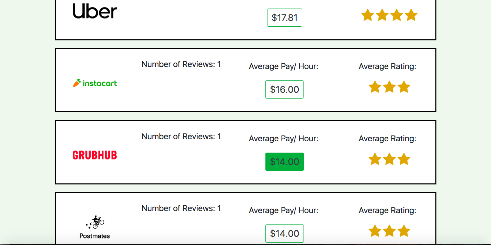
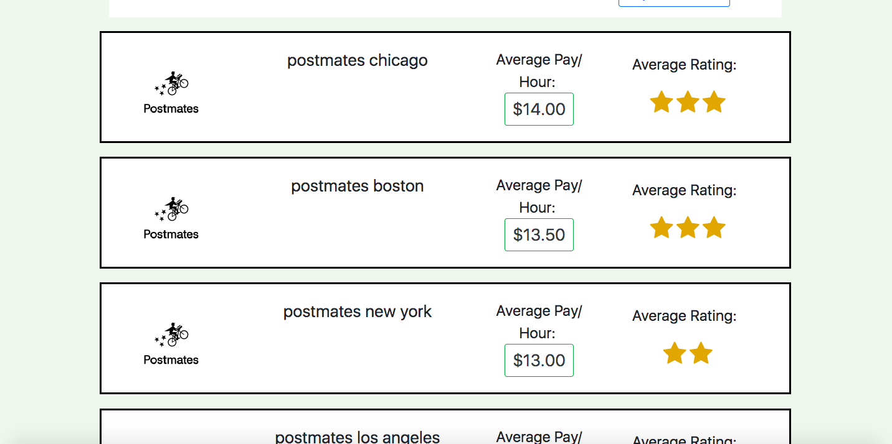
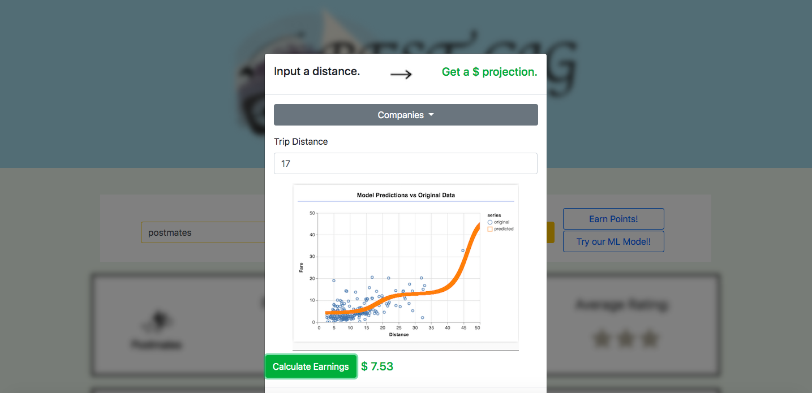

# BestGig

## Site Disclaimer

BestGig is a platform for gig economy workers to get wage forecasts, filtered by location. Due to the early stage of this project, many individual cities don't currently have valid reviews of employers. To simulate the real feel of the site, we planted seed data for five larger areas (San Francisco, Los Angeles, Boston, New York, and Chicago). These averages are provided by Glassdoor, and were only calculated for some of the larger players in the gig economy (Uber, Lyft, Postmates, Doordash, Grubhub, and Instacart), who had enough reviews to be subdivided into various geographic regions. 

[Live Site](https://bestgig.herokuapp.com/)

## Motivation

The American economy is in a state of flux, with over 35% of workers participating in the gig economy. Disruptive forces like Uber and Lyft have given workers incredible freedom to choose their own hours. Unfortunately, there are plenty of negative trends for workers (especially as the machine learning advances make autonomous vehicles more of a reality). 

Our goal was to build a platform that would empower gig workers. They’d be able to submit reviews and hourly wages, and in return get access to our service. We wanted to invert the role of machine learning, and build a model that could predict an hourly rate based on factors like day of the week, time of day, and location. 

As it currently stands, our model is a bare bones proof of concept. However, with time we hope to get access to more driver data, and eventually build a multi-factor model with the factors most relevant to workers. 

Under this paradigm, workers would be able to rent out their services to the companies offering the best rates. The ultimate hope is that this level of competitive rate comparison would force these larger gig economy companies to offer better wages to their workers.

## Design Iterations 

From an interface perspective, we considered making the website openly accessible (no login necessary). Users preferred the more rapid access, so it made a ton of logical sense. Ultimately, we included the login popup since we envisioned a service where users could maintain their accounts by continuously submitting new data to be fed into the model. 

There were also multiple structures for our backend, with one-to-one and one-to-many mappings as potential options for the underlying MySQL storage structure. We settled on allowing a user to leave multiple reviews, and storing multiple geographic reviews under a single company. 

## Here’s how BestGig works:

When you arrive at the site, you’re prompted to give your information and location. This is so we can show you results relevant to your location and associate reviews with your account (if you want current results, please choose one of the following: San Francisco, Los Angeles, Boston, Chicago, New York).

From there, you’re shown a list of the gig companies in your area, sorted by average hourly wage (each with an associated star rating). 

If you want to all rates for a particular company (regardless of location), look it up in the search bar. 

## Machine Learning Component 

Our initial goal was to build a multi-factor model. For a longer description of our design process, click here: (https://www.linkedin.com/pulse/using-machine-learning-empower-gig-workers-greyson-gerhard-young/). The ultimate result was a polynomial regression model that uses the distance of an Uber ride to predict its fare (and subsequently, the wage a driver will earn). 
   
We couldn’t find a significant relationship between the time of day and an Uber fare, so we settled on the above parameters. The Tensorflow.js is not embedded in the live site, but the curve we produced is based on our original model (which used multiple layers of sigmoids and a mean squared error optimizer). 

## Concluding Thoughts 

In the future, we want to explore more complex models. The continuous nature of this problem made it a difficult one to solve, and that might be improved by discretizing it into a classification problem, where the classes represent categories of wages. One of our key takeaways was that without the requisite data, it was extremely difficult to produce significant results. Thus, we designed the service to eventually facilitate that necessary data collection. 

## Technologies Used
* [Visual Studio Code](https://code.visualstudio.com) - source code editor
* [Node](https://nodejs.org/en/) - a run-time environment that executes Javascript code outside the browser
* [Bootstrap](https://getbootstrap.com/) - framework for creating responsive page with CSS, jQuery, and JS
* [Tensorflow.js](https://www.tensorflow.org/js) - open source library for client side machine learning

## Node Packages
* [Sequelize](https://www.npmjs.com/package/sequelize) - a promise-based node.js ORM for MySQL.
* [Express](https://www.npmjs.com/package/express) - a minimalist web framwork for node.js
* [Express-Handlebars](https://www.npmjs.com/package/express-handlebars) - used to send html for routes.
* [MySQL2](https://www.npmjs.com/package/mysql2) - used to access MySQL database from node and use with Sequelize ORM

## APIs
* [Algolia](https://community.algolia.com/) - Geocoder for populating location names. Autocompletes locations (specified city in California) on search

## Extra
* [kartik-v bootstrap-star-rating](https://github.com/kartik-v/bootstrap-star-rating) - jQuery plugin for rendering star scoring system that works with Bootstrap

--------------------------------------------------
## Author links
### Adrienne Liu
* [GitHub](https://github.com/adrienneliu)
* [LinkedIn](https://www.linkedin.com/in/liu-adrienne/)

### Daniel Chicchon
* [GitHub](https://github.com/dchicchon)
* [LinkedIn](https://www.linkedin.com/in/danielchicchon/)

### Greyson Gerhard-Young
* [GitHub](https://github.com/greysongy)
* [LinkedIn](https://www.linkedin.com/in/greyson-gerhard-young/)

### Joey Badua
* [GitHub](https://github.com/joannebadua)
* [LinkedIn](https://www.linkedin.com/in/joey-badua-b24b2729/)

